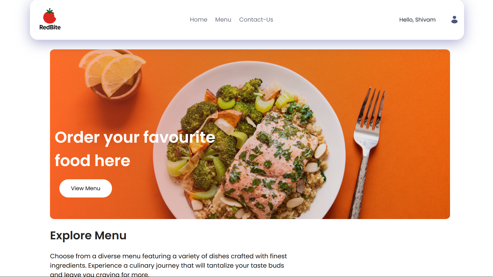
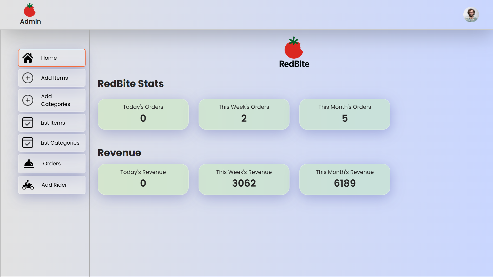
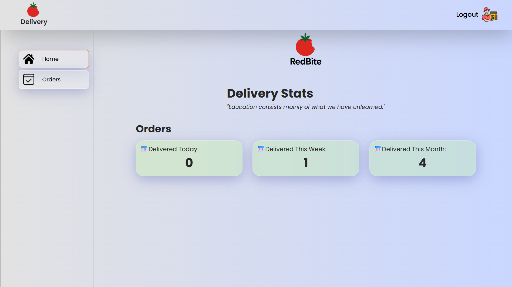

# 🍅 RedBite

A complete food ordering web application built with MERN stack(MongoDB, Express.js, React, Node.js)!, which has three panels:

| User Panel                                                 | Admin Panel                                                       | Delivery Panel                                                          |
| ---------------------------------------------------------- | ----------------------------------------------------------------- | ----------------------------------------------------------------------- |
|  |  |  |

## 🔗Link

- **User Panel:** https://redbite-final.vercel.app/
- **Admin Panel:** https://redbite-final-admin.vercel.app/
- **Delivery Panel** https://redbite-final-delivery.vercel.app/

## 🧰 Tech Stack & Libraries

##### Frontend:

- ⚛️ React + Vite: Frontend library
- 📦 Axios: HTTP client for API calls
- 📡 React Router: Routing in application
- 🔥 react-hot-toast: Toast notifications
- 🔥 react-toastify: Toast notifications
- ☁️ Cloudinary: Image upload
- 📄 html2pdf: Print bills in pdf
- 
##### Backend:

- 🧪 Node.js + Express
- 🌿 MongoDB + Mongoose
- 🔐 jsonwebtoken (JWT): Authentication
- 🔑 bcrypt
- 📁 multer
- 📨 nodemailer + Gmail's SMTP

##### Deployment:

- 🌐 Vercel (Frontend)
- 💻 Render (Backend)

---

## 🕹️ Features

### User Panel:

- OTP authentication for users using Nodemailer with Gmail's SMTP service.
- Category-wise distribution of food-items.
- Forgot Password functionality through OTP verification.

### Admin Panel:

- Admin Panel to add, update, delete food items, categories.
- Generate new Id and password for rider through which a new rider can be added.
- Displays daily, weekly and monthly stats and revenue.
- Generates bill for every order in pdf format.

### Delivery Panel:

- Rider can accept the order and has a field to enter OTP which the customer will give at the time of order delivey.
- Rider can see daily, weekly and montly orders delivered by him.
